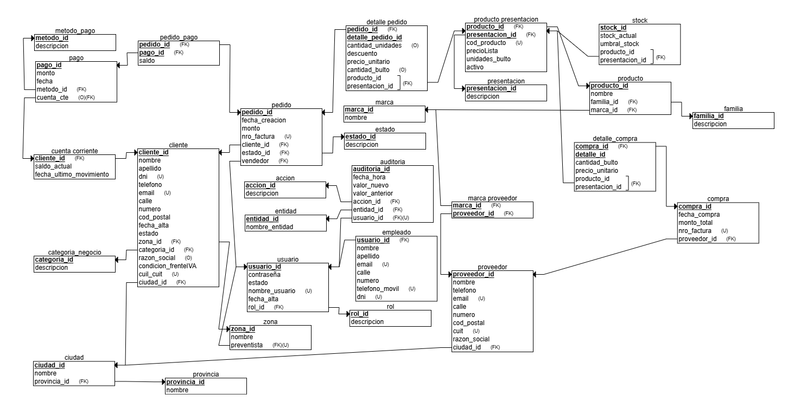

# Proyecto de Estudio: ARIMA

**Asignatura**: Bases de Datos I (FaCENA-UNNE)

**Integrantes**:

- Samuel Zini
- Gaston
- Mercedes Silvana Fernández
- Hugo elias

**Año**: 2025

## CAPÍTULO I: INTRODUCCIÓN

### Caso de estudio

El objetivo de este trabajo es especificar, diseñar e implementar una base de datos relacional inspirada en Chess ERP, adaptada a un alcance reducido y con fines académicos para la asignatura Base de Datos 1 de la carrera Licenciatura en Sistemas de Información (Facultad de Ciencias Exactas, Naturales y Agrimensura, Universidad Nacional del Nordeste). El sistema funcionará sobre un servidor de bases de datos local y deberá cubrir las siguientes funcionalidades y requisitos:

### Definición o planteamiento del problema

El diseño final debe priorizar la práctica de conceptos de bases de datos vistos en la materia (modelo conceptual, modelo entidad-relación, normalización hasta 3FN, integridad referencial, restricciones, índices, consultas SQL, vistas, procedimientos, transacciones y otros conceptos).

### Objetivo del Trabajo Práctico

#### Objetivos Generales

Ejecutar los conceptos teoricos y practicos aprendidos en las clases y examenes parciales de la asignatura.

#### Objetivos Específicos

Soportar la gestión básica de un negocio de venta de productos mediante módulos de administración de productos, gestión de clientes y preventistas, procesamiento de ventas/pedidos y generación de reportes administrativos.

## CAPITULO II: MARCO CONCEPTUAL O REFERENCIAL

En la actualidad, resulta difícil pensar en la gestión empresarial sin el apoyo de sistemas informáticos que automaticen procesos clave. La administración de clientes, productos, ventas e inventarios requiere cada vez más soluciones integradas que permitan reducir errores, agilizar operaciones y disponer de información confiable en tiempo real. Estas necesidades han impulsado la creación de herramientas que unifican la gestión en un único sistema, con el fin de mejorar la eficiencia operativa y la competitividad de las organizaciones.

Dentro de este contexto, los sistemas ERP (Enterprise Resource Planning) se han posicionado como una de las principales alternativas de solución. Estos sistemas permiten centralizar la información de distintas áreas de una empresa en una misma base de datos, evitando duplicidad de registros y facilitando la toma de decisiones estratégicas. Gracias a ello, procesos que antes se llevaban en planillas separadas o de manera manual ahora se encuentran interrelacionados y gestionados desde una plataforma centralizada.

El papel de las bases de datos relacionales resulta esencial en este escenario. Motores como SQL Server permiten almacenar y procesar grandes volúmenes de datos estructurados, garantizando la integridad, la consistencia y la seguridad de la información. La organización en tablas con claves primarias y foráneas posibilita modelar entidades como clientes, productos, pedidos y proveedores, reflejando de forma lógica las relaciones del mundo real. Además, al permitir consultas eficientes mediante SQL, se facilita el acceso a datos confiables y actualizados para la gestión diaria.

Nuestro caso de estudio —desarrollado en el repositorio MercedesHugo— se orienta a la implementación de un sistema bajo una arquitectura en capas, un modelo de diseño ampliamente utilizado en el desarrollo de software empresarial. La arquitectura está organizada en cuatro niveles principales:

Capa de Entidades: Representa los objetos centrales de la aplicación, como Clientes, Productos, Proveedores o Pedidos. Estas entidades funcionan como el puente entre el modelo de datos y el resto del sistema.

Capa de Datos: Gestiona la comunicación con la base de datos. En este nivel se definen las consultas, procedimientos y operaciones CRUD necesarias para almacenar y recuperar información.

Capa de Negocio: Contiene la lógica y las reglas de negocio de la aplicación. Aquí se realizan validaciones, cálculos y procesos que aseguran que las operaciones se ejecuten correctamente según las necesidades de la organización.

Capa de Presentación: Es la interfaz gráfica que interactúa directamente con el usuario final. Su objetivo es ofrecer una experiencia simple y clara, permitiendo que los procesos empresariales sean ejecutados de forma intuitiva.

El uso de esta arquitectura multicapa no solo mejora la organización del proyecto, sino que también facilita la escalabilidad y el mantenimiento del sistema. En caso de que la empresa desee incorporar nuevos módulos, como facturación electrónica o gestión de logística, estos pueden añadirse sin afectar el resto de la aplicación, lo que brinda flexibilidad y asegura la evolución del software en el tiempo.

Asimismo, la integración de SQL Server con el sistema garantiza que los datos se manejen de manera segura y eficiente. Este motor de base de datos no solo ofrece herramientas para mantener la integridad referencial, sino que también incorpora funciones avanzadas como transacciones, procedimientos almacenados y vistas, que fortalecen la consistencia y fiabilidad de la información empresarial.

## CAPÍTULO III: METODOLOGÍA SEGUIDA

**a) Cómo se realizó el Trabajo Práctico**  
Nuestro caso de estudio se dividió en 6 fases, las cuales se detallan a continuación:

**Fases del desarrollo**  

- **Fase de elección de caso de estudio:** La elección del caso de estudio fue realizada sin complicaciones ni objeciones por parte de ningún integrante del grupo. Primero nos inclinamos hacia la gestión de un hospital debido a contar con bastante información sobre ese tipo de sistemas, pero finalmente decidimos hacerlo sobre una distribuidora de alimentos, ya que un integrante del grupo tiene acceso a un ERP (Enterprise Resource Planning). Esto nos permitió trabajar de una manera más profesional y fiel a lo que se usa en el mundo corporativo real.  

- **Fase del diseño conceptual:** Esta fase fue llevada en gran parte por dos integrantes del grupo que ya estaban trabajando en un proyecto similar en la materia *Taller de Programación 2*. Por ello, ya tenían desarrollado un diseño conceptual previo, el cual fue explicado al resto del grupo. Luego de un intercambio de ideas, lo ajustamos en conjunto y obtuvimos la versión final.  

- **Fase del diseño Modelo Entidad-Relación (ER):** Una vez definido y consolidado el concepto general de nuestra base de datos, elaboramos un diagrama entidad-relación (DER). En este esquema representamos gráficamente las entidades principales, junto con sus atributos más relevantes. También dejamos claramente establecidas las relaciones entre ellas, lo que permitió visualizar la estructura lógica de los datos, identificar dependencias y asegurar coherencia antes de pasar a la fase de desarrollo.  

- **Fase de desarrollo:** En esta fase cada integrante trabajó en su parte del proyecto, y a su vez cada tema se dividió en dos instancias: desarrollo del script y creación de la documentación. Entre los temas desarrollados se encuentran:  
  - Manejo de permisos a nivel de usuarios de base de datos.  
  - Procedimientos y funciones almacenadas.  
  - Optimización de consultas a través de índices.  
  - Triggers.  

- **Fase de explicación de temas:** Una vez listos los scripts, organizamos una charla grupal en la que cada integrante explicó qué le había tocado, cómo lo resolvió y cuáles eran las partes más importantes de su trabajo. Algunos mostraron pasos técnicos, otros compartieron tips o problemas que tuvieron. Esto nos permitió tener una visión integral del trabajo de todos y no solo de la parte individual.  

- **Fase final:** Finalmente, realizamos una revisión completa y detallada del proyecto. Repasamos punto por punto el repositorio, la documentación y el código con el objetivo de detectar errores o detalles pasados por alto. Gracias a este repaso, logramos corregir a tiempo y dejar el proyecto en condiciones óptimas antes de darlo por finalizado.  

---

**b) Herramientas (Instrumentos y procedimientos)**  
Para llevar adelante el trabajo utilizamos un conjunto de herramientas básicas pero efectivas:  

- **GitHub:** Para el control de versiones y la colaboración grupal en un repositorio compartido.  
- **SQL Server:** Como motor de base de datos para la implementación de scripts, pruebas y validación.  
- **Visual Studio Code:** Para la edición de código y documentación en un entorno sencillo y práctico.  

## CAPÍTULO IV: DESARROLLO DEL TEMA / PRESENTACIÓN DE RESULTADOS

Maecenas molestie lacus tincidunt, placerat dolor et, ullamcorper erat. Mauris tortor nisl, ultricies ac scelerisque nec, feugiat in nibh. Pellentesque interdum aliquam magna sit amet rutrum.

### Diagrama conceptual (opcional)

### Diagrama relacional

### Diccionario de datos

Acceso al documento [PDF](doc/diccionario_datos.pdf) del diccionario de datos.

### Desarrollo TEMA 1 "----"

Fusce auctor finibus lectus, in aliquam orci fermentum id. Fusce sagittis lacus ante, et sodales eros porta interdum. Donec sed lacus et eros condimentum posuere.

> Acceder a la siguiente carpeta para la descripción completa del tema [scripts-> tema_1](script/tema01_nombre_tema)

### Desarrollo TEMA 2 "----"

Proin aliquet mauris id ex venenatis, eget fermentum lectus malesuada. Maecenas a purus arcu. Etiam pellentesque tempor dictum.

> Acceder a la siguiente carpeta para la descripción completa del tema [scripts-> tema_2](script/tema02_nombre_tema)

...

## CAPÍTULO V: CONCLUSIONES

Nunc sollicitudin purus quis ante sodales luctus. Proin a scelerisque libero, vitae pharetra lacus. Nunc finibus, tellus et dictum semper, nisi sem accumsan ligula, et euismod quam ex a tellus.

## BIBLIOGRAFÍA DE CONSULTA

 1. List item
 2. List item
 3. List item
 4. List item
 5. List item
